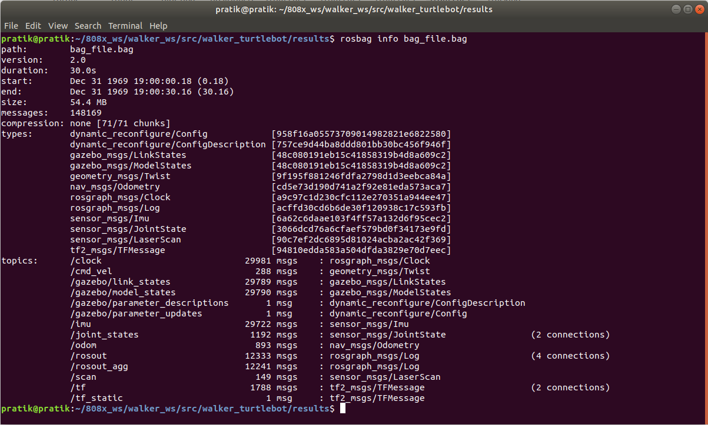

# Walker TurtleBot
[](https://opensource.org/licenses/MIT)
## Overview
This repository consist node to move TurtleBot around gazebo world or its environment with obstaacle avoidance feature. The robot moves forward until it reaches an obstacle, then rotate left or right in place depending on obstacle until the way ahead is clear, and then move forward again and repeat. 
Also consist launch file with argument to record rosbag i.e. disable/enable.

## License
MIT License  
Copyright (c) 2021 Pratik Bhujbal
```
Permission is hereby granted, free of charge, to any person obtaining a copy of this software and associated documentation files (the "Software"), to deal in the Software without restriction, including without limitation the rights to use, copy, modify, merge, publish, distribute, sublicense, and/or sell copies of the Software, and to permit persons to whom the Software is furnished to do so, subject to the following conditions:
The above copyright notice and this permission notice shall be included in all copies or substantial portions of the Software.
THE SOFTWARE IS PROVIDED "AS IS", WITHOUT WARRANTY OF ANY KIND, EXPRESS OR IMPLIED, INCLUDING BUT NOT LIMITED TO THE WARRANTIES OF MERCHANTABILITY, FITNESS FOR A PARTICULAR PURPOSE AND NONINFRINGEMENT. IN NO EVENT SHALL THE AUTHORS OR COPYRIGHT HOLDERS BE LIABLE FOR ANY CLAIM, DAMAGES OR OTHER LIABILITY, WHETHER IN AN ACTION OF CONTRACT, TORT OR OTHERWISE, ARISING FROM, OUT OF OR IN CONNECTION WITH THE SOFTWARE OR THE USE OR OTHER DEALINGS IN THE SOFTWARE.
```
## Dependencies

- **Ubuntu 18.04**
- **ROS Melodic**  
- **Turtlebot3 ROS Package**

## Installation 
1. All turtlebot3 pakages install
    ```bash
    sudo apt-get install ros-melodic-turtlebot3-*
    ```
2. Only turtlebot3_gazebo package (If you dont want extra packages)
    ```bash
    sudo apt-get install ros-melodic-turtlebot3-gazebo 
    ```
3. Select TurtleBot Model and setup environmental variable for that
    ```bash
    echo "export TURTLEBOT3_MODEL=waffle pi" >> ~/.bashrc
    ```
## Build your package
```bash
mkdir -p <your_workspace_name>/src
cd <your_workspace_name>/src
git clone https://github.com/Prat33k-dev/walker_turtlebot.git
cd <your_workspace_name>
catkin_make
```
## Launching TurtleBot world and TurtleBot with launch file
1. Running launch file with rosbag record arguments
    ```bash
    cd <your_workspace_name>
    source devel/setup.bash
    roslaunch walker_turtlebot walker_bot.launch rosbag_record:=true
    ```
2. Running launch file without arguments (default rosbag record will be disable)
    ```bash
    cd <your_workspace_name>
    source devel/setup.bash
    roslaunch walker_turtlebot walker_bot.launch
    ```

## Inspecting and Running rosbag file
1. Open your workspace in new terminal
    ```bash
    roscore
    cd ~/<your_workspace_name>/src/walker_turtlebot/results/
    rosbag info bag_file.bag
    rosbag play bag_file.bag
    ```
* Output for rosbag info  


2. Verify using walker_bot node
    ```bash
    source devel/setup.bash
    rosrun walker_turtlebot walker_bot
    ```

* Output for rosbag play with walker_bot node


## Run cppcheck and cpplint
* The Output txt files will be saved under results folder  

For cppcheck
```bash
sh run_cppcheck.sh
```
For cpplint
```bash
sh run_cpplint.sh 
`````

## Author
- Pratik Bhujbal  UID: 117555295   
  Github URL: https://github.com/prat33k-dev
